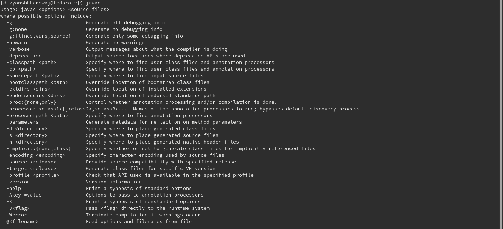
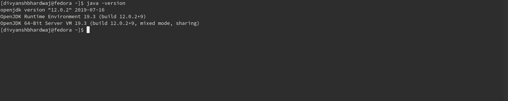

# Steps to install JDK

## Requirements
1. Operating System: Any 64-bit operating system is suggested, Java provides support for all the major OS,
namely, Windows, Linux and MacOS. It is suggested to have the latest version installed for either one of those.
2. RAM: Suggested 8GB, you may also work with 4GB.
3. The latest stable release of JDK acquire from an official source.

---

## Links to download JDK
1. [Oracle JDK 12](https://www.oracle.com/technetwork/java/javase/downloads/jdk12-downloads-5295953.html)
2. [Open JDK 12](https://jdk.java.net/12/)

---

## Steps for Windows
1.  Download the JDK  setup file (.exe) from the link given above.
2.  Double-click the file and run the installer. The options given are fine, just click next to all prompts.
3.  Now, we need to set-up the PATH for the JDK installation. For Windows, it is "C:\Program Files\Java\jdk-12.0.2\bin".
4.  Press start button (windows button) + R to open the Run menu.
5.  Type `control system` in the box and press enter.
6.  A new window will open, on the left-hand side, there will be an option named "Advanced System Settings", click on it.
7.  A new window will open, on the bottom, there will be an option named "Environment Variables", click on it.
8.  A new window will open, there will be two boxes, on the top one there will be a variable named "PATH", double click on it.
9.  On the right-hand side, there will be an option for "New" and then click "Browse", in the new window that opened go to the path described in step number 3 and click "ok".
10. Close all the windows by clicking "ok"

## Steps for Linux
Chances are, your distribution on Linux will already have some version of Java JDK installed, if not, then atleast the
JRE, you can go to the next section and verify it.

---

## How to verify your installation
1. Press Win + R, and type `cmd`, then, press enter.
2. In the command prompt, type `javac` and press enter.

3. Your command prompt will output some arguments related to javac. If yes, then your javac is working.
4. Next, type `java -version` and press enter.

5. Your command prompt will tell you the version of java installed on your computer.